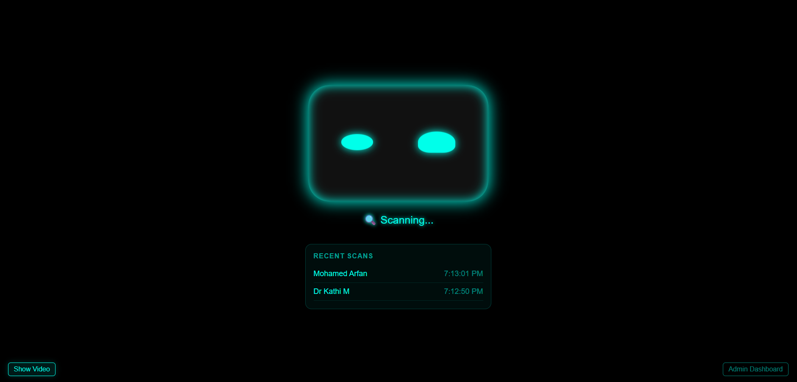
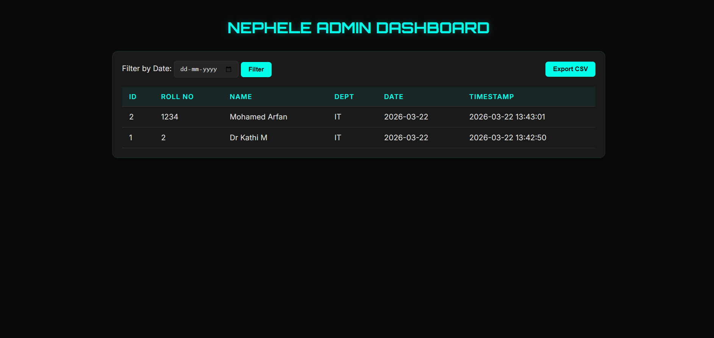

# 🤖 NEPHELE 3.0: Cloud-Powered Robot Attendance System

Nephele 3.0 is a modern, **QR Code-based attendance system** specifically designed to test attendance tracking for **cloud-powered robots**. It features a "Robot Face" UI, real-time QR scanning, audio feedback, and a dedicated admin dashboard for record management.

  
  


## ⚙️ Key Features
 - **Real-time QR Scanning**: Optimized for robot cameras using `jsQR`.
 - **Audio Feedback**: Voice responses for a natural robot-human interaction.
 - **Video Toggle**: A dedicated "Show Video" button for developer testing and calibration.
 - **Recent Scans**: Live session history directly on the robot's "face".
 - **Admin Dashboard**: Secure management and CSV export for attendance logs.
 - **Duplicate Prevention**: Intelligent logic to prevent double-marking.

---

## 🛠️ Tech Stack
- **Backend**: FastAPI (Python), SQLite3, Pydantic
- **Frontend**: Vanilla HTML/CSS/JS, jsQR, SpeechSynthesis API
- **Configuration**: Dotenv (`.env`)

---

## 🚀 Getting Started

### 1. Prerequisites
- Python 3.8+
- A device with a camera (for scanning)

### 2. Installation
Clone the repository and set up a virtual environment:

**Windows:**
```bash
python -m venv venv
.\venv\Scripts\activate
pip install -r requirements.txt
```

**macOS / Linux:**
```bash
python3 -m venv venv
source venv/bin/activate
pip install -r requirements.txt
```

### 3. Configuration
The system uses environment variables for configuration. You can modify the `.env` file:
```env
DB_NAME=attendance.db
HOST=127.0.0.1
PORT=8000
DEBUG=True
```

### 4. Running the System
Start the FastAPI server:
```bash
python main.py
```

### 5. Accessing the UI
- **Scanner Interface**: [http://127.0.0.1:8000/](http://127.0.0.1:8000/)
- **Admin Dashboard**: [http://127.0.0.1:8000/admin](http://127.0.0.1:8000/admin)

---

## 📁 Project Structure
- `main.py`: The core FastAPI application serving endpoints and static files.
- `main.html`: The scanner interface with live camera feed and session history.
- `admin.html`: The attendance record management dashboard.
- `config.py`: Configuration loader for environment variables.
- `attendance.db`: SQLite database for persistent storage.

---

## 🛡️ Security Note
The current configuration uses `CORSMiddleware` with `allow_origins=["*"]` for development ease. For production deployment, ensure you restrict the origins to your specific domain.